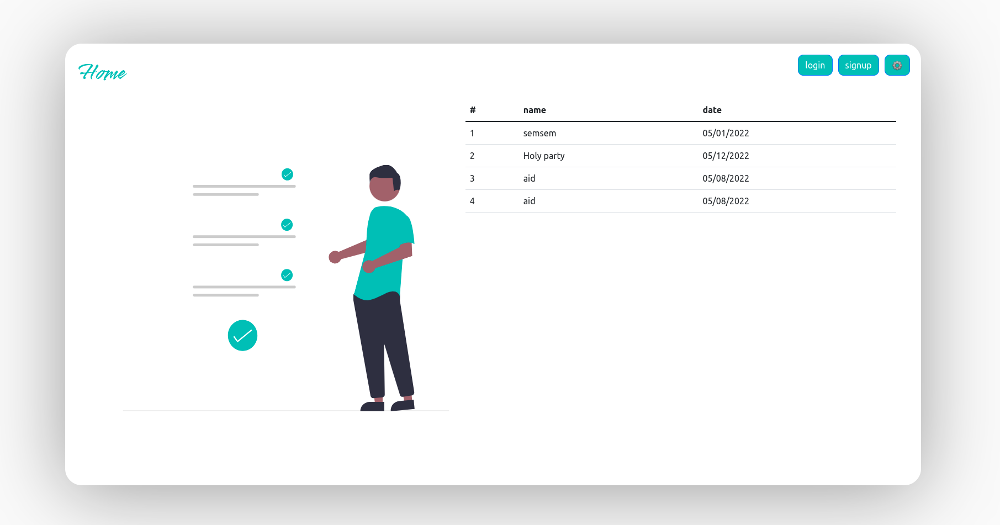
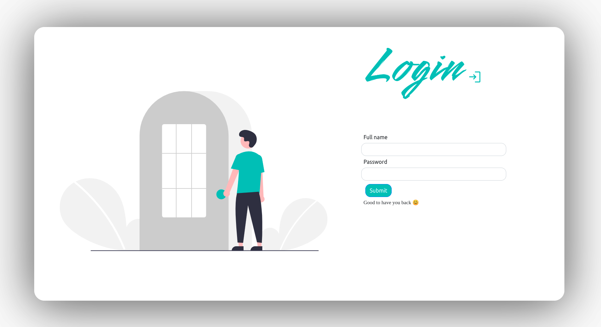
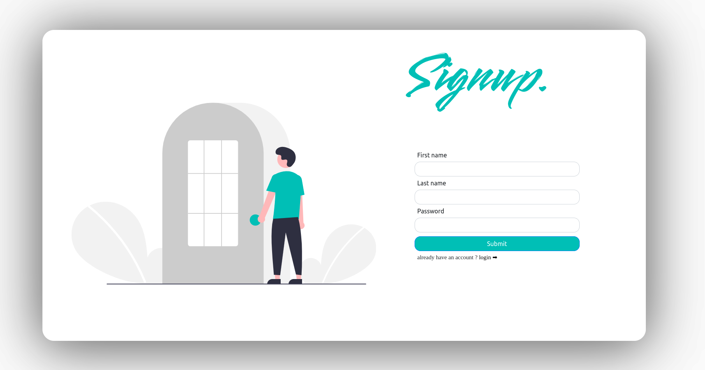
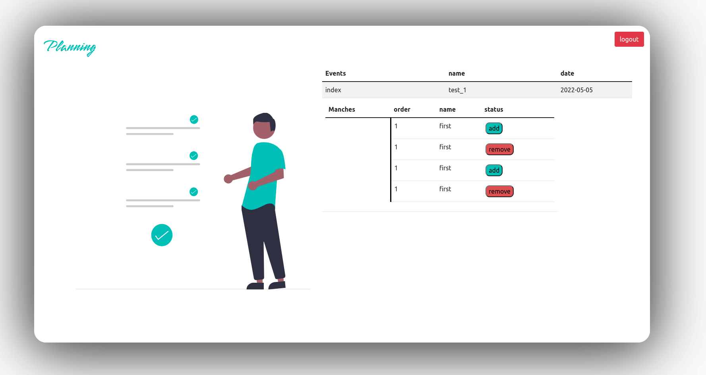

## Node.js and React.js Single page application
    
    This was the first time I used this advanced frameworks to creat a web application. The thechnologies 
    used to creat this simple application in the backend was Nodejs with express.js,dotenv,postgren 
    json and uuid for our unique ids. For the frontend side we used reactjs with routers and links some html and bootstrap for styling.

#### Home page
    This page was the home page where the user could see all the exesting events and their begining dates

#### Login page
    This is the login page where the user can gain access to the planning page so that he can sinup for an event 

#### Signup page 
    This is the signup page for our new users who does not have an account 

### Planning page
    This is the planning page where the user can add an event to his list or remove one, and each event have multiple stages

#### Info
    This was a side school project it's not done yet, the project could be much more than that it's just 
    matter of time for me to finish it because I am so interested in this technologies 